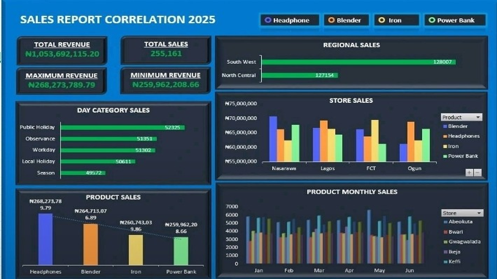

# 📊 Sales Report Correlation 2025 Dashboard  

A **comprehensive and interactive data visualization dashboard** for analyzing sales performance in **2025**.  
This project provides key insights into **total revenue, product sales, regional performance, and daily sales trends**, enabling **data-driven decision-making**.  

---

## ✨ Features  

- **Total Sales & Revenue Metrics**  
  Quick-view KPI cards displaying:  
  - Total Revenue: **₦1,053,692,115.20**  
  - Total Sales: **255,161**  
  - Maximum / Minimum Revenue  

- **Regional Analysis**  
  Visual representation of sales performance across regions, with focus on **South West** and **North Central**.  

- **Store-Level Breakdown**  
  Detailed bar charts showing sales distribution across stores like **Nasarawe, Lagos, FCT, and Ogun**.  

- **Product Performance**  
  Breakdown of sales by product category:  
  - Headphones  
  - Blenders  
  - Iron  
  - Power Banks  
  Includes **monthly sales trend charts**.  

- **Day Category Insights**  
  Analysis of sales performance on **Public Holidays, Workdays, and Weekends** to identify behavioral patterns.  

- **Interactive & Responsive**  
  Designed for easy navigation and accessibility on different screen sizes.  

---

## 🛠️ Tools Used  
- **Microsoft Excel** (Data Cleaning, Analysis & Dashboard Design)  

---

## 📷 Dashboard Preview  
(sales_report_resized_v2_1024Corr.png)
```markdown

